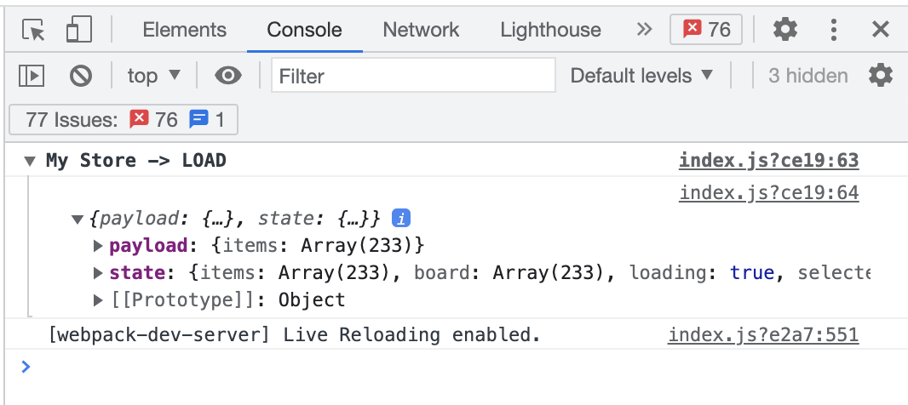

<br />
<br />
<br />


<p align="center">Agnostic & Simple State Managment library for Javascript Applications</p>
<p align="center">
  
  
</p>

<br />
<br />
<br />

## Motivation 🎖

1. **Simplicity** - Helping us to create an easy and straightfowared state managment library without bloated boilerplates.
2. **Flexibility** - Giving us access to any level of properties of our state tree.
3. **Agnostic** - Compatible with any frameworks and vanilla javascript, aiming ubiquity.
4. **Testing ready** - Easy to test and isomorphic by Design. Actions are pure functions and state a JSON object, you can test it with any testing libraries without any dependencies.
5. **React** : **No Providers wrappers are needed for your application**, just use hooks to connect component with your store.

<br />
<br />

<p align="center">
  <a href="https://react-mvc-architecture-spowy3.stackblitz.io" target="_blank"></a></p>

<br />
<br />

## Differences between Redux Philosophy 👓

### Redux's strategy

The main difference between Redux strategy and Oni is the fact that Redux works with composible functions called reducers. Each reducers responds to a one or several actions, so in order to track changes regarding where a certain change happens, you need to look to the property of the state and look for the reducer that has the responsibility to change it. By using Redux tools it shouldn't be a big problem, but there's a limitation...

The reducer is restricted to only 1 property of your state. But there's a plenty situations where you want to change more then 1 property of your state given an action fired.

### Oni's strategy

Oni's strategy is about merging Redux principle with State Machine concepts creating another pattern.
After a dispatch call, Oni will match the registered action function, executing it and providing the actual state, that action will be responsible to change any property of the state tree.

So, in order to know what has changed a specific property of you app state, you need to look for the action fired.

---

## Installing ⚡️

`yarn add @javiani/onijs` or `npm install @javiani/onijs`
<br />
<br />
<br />

## Creating a Store instance 🕋

`./src/stores/my-store.js`

```js
import Oni from '@javiani/onijs'

const initialState = {
  user: { ... },
  counter: 0
}

export const store = Oni( initialState,  {
  /**  @Actions **/
  COUNTER_ADD: ( state, { increment = 1 }) => {
    return {
      counter : state.counter + increment
    }
  },

  COUNTER_SUBTRACT: ( state, { decrement = 1 }) => {
    return {
      counter: state.counter - decrement
    }
  }
})

```

First parameter is the serializable object `initialState`, the second is a collection of `actions` that you can name using your own pattern and getting payload from a **dispatch** call.

<br />
 
> 💡 You don't have to return all properities inside an action, only the ones you want to update.

<br />
<br />

## Using the store instance 👩🏻‍💻

```js
import store from './src/stores/my-store.js'

// Subscribe a function that will be called after every dispatch call
const unsubscribe = store.subscribe( ( (state, { action, payload }) => {
  console.log( state, action, payload )
}

// Unsubscribe
unsubscribe() // Removes that subscriber function from update function list.

// Firing an action
store.dispatch('COUNTER_ADD', { increment: 2 }) // Second parameter can be any serializable object.

// Getting the current store state
store.getState()

```

<br />
<br />

## React Adapter 🔌

You can use the React Hook adapter in order to use it on your React applications preserving the code design of the framework.

`shared/store/my-store.js`

```js
import { createStore } from '@javiani/onijs/react'

const initialState = {
  user: { ... },
  counter: 0
}
// Exporting store vanilla for subscribing effects and the useStore hook
export const { store, useStore } = createStore(initialState, {
  /** @Actions **/
  COUNTER_ADD: (state, { payload }) => ({
    counter: state.counter + 1
  }),

  COUNTER_SUBTRACT: (state, { payload }) => ({
    counter: state.counter - 1
  })
})


```

`components/my-component.js`

```jsx
import { useStore } from "shared/store/my-store.js";

export default function MyComponent() {
  // All available options : { state, action, payload, dispatch }
  const { state, dispatch } = useStore();

  const onButtonClick = (e) => {
    dispatch("COUNTER_ADD", { increment: 5 });
    // After dispatch:
    // action will be : COUNT_ADD
    // payload will be: { increment: 5 }
    // state will be current state
  };

  return (
    <div className="counter">
      <h1>Counter</h1>
      <p>{state.counter}</p>
    </div>
  );
}
```

<br />

### Restricting Updates

Every React component that use the custom hook `useStore` will automatically update on every state changes. Since state is not a primitive value, it's not a good idea to use `useEffect` in order to respond when some prop has changed, instead, you can specify what kind of actions your component will be listening to:

```jsx
export default function CounterDisplay() {
  // All available options : { state, action, payload, dispatch }
  const { state } = useStore(["COUNTER_ADD", "COUNTER_SUBTRACT"]);

  return (
    <div className="counter-display">
      <h1>Counter Display</h1>
      <p>{state.counter}</p>
    </div>
  );
}
```

The component above will only rerender if some other component has dispatched : `COUNTER_ADD` and `COUNTER_SUBTRACT`.
So here, we are thinking different from the prop change approach, we are saying that this component should react to a certain kind of actions on your application.

## Logging

A important thing to keep in mind is how to log the changes in order to debug what's really happening on your app.
There's a simple and straightforward way to check what action was called and the current state, there's no need to install any extension in the browser, we can use the console tool for this matter:
<br />
<br />

<p align="center">
  
</p>

```js
store.subscribe((state, { action, payload }) => {
  console.groupCollapsed(`My Store -> ${action}`);
  console.log({ payload, state });
  console.groupEnd();
});
```

<br clear="all" />
<br />
<br />

No middlewares, no browsers extensions, no magic. Fell free to design your own way to display the information you need, **it's up to you, it's on your control**.

<br />
<br />

## Pattern Matching  - Vanilla js

Every `dispatch` calls will force an update in the store that will notify all subscribers. So in order to specify a specific action you wanna a component respond to, you can use a switch case to test the action in the callback function, or you can use the `.patternMatch` api instead of `subscribe`.

```js
store.patternMatch({
  COUNTER_ADD: (state) => doSomethingOnAddCount(state.counter),
  COUNTER_SUBTRACT: (state) => doAnotherThing(state.counter),
});
```

The code above is equivalent to:

```js
store.subscribe((state, { action, payload }) => {
  switch (action) {
    case "COUNTER_ADD":
      doSomethingOnAddCount(state.counter);
      break;
    case "COUNTER_SUBTRACT":
      doAnotherThing(state.counter);
      break;
  }
});
```

<br />

## Async Changes

We belive that Javascript has a great set of tools and strategies to deal with concurrency but it can be very chalenging for those who are starting in the Front-end carrer or for those that are starting in a new team, so we wanna keep it as most simple as we can. So we highly recommend to break down in more actions to give a nice and clean flux of your application.

E.g
We wanna to dispatch an action that will fetch a list of products and in the same time update our UI loading state.

**Disclaimer: Feel free to create side-effect actions if you intend to simplify your architecture**

```js
const actions = {
  GET_PRODUCTS: (state, { url }, { dispatch }) => {
    fetch(url)
      .then((response) => response.json())
      .then((products) => dispatch("LOAD_PRODUCTS_FROM_API", { products }));

    return {
      loading: true,
    };
  },

  LOAD_PRODUCTS_FROM_API: (state, { products }) => {
    return {
      products,
      loading: false,
    };
  },
};
```

As you can see, the third parameter provides the Oni instance, so you can call another `action` from there, we belive that's the best way to any other developer figure out just by looking at the action what is gonna be the next step.

There are other ways to do the same thing we did in the code above, if you want to let your actions pure, you can make the service call from a component and delegate to the action only the orchestration of the state transitions of your application:

```js
const actions = {
  GET_PRODUCTS: (state, { productsPromise }, { dispatch }) => {
    productsPromise.then((products) =>
      dispatch("LOAD_PRODUCTS_FROM_API", { products })
    );
    return {
      loading: true,
    };
  },

  LOAD_PRODUCTS_FROM_API: (state, { products }) => {
    return {
      products,
      loading: false,
    };
  },
};

```

The use case above is telling us that some part of the application make a request, so the store updated the UI loading state, while it waits for the response, which when is resolved it will update UI with loading state set to `false` and the product list provided by the request.

<br />
<br />

## What about Async functions? 🧐

You see that we used `.then` interface from Promises in the example above, you can use async functions in order to use `async` & `await` features, but be aware that by doing that, your action will return always a `Promise` so you won't be able to change application state right after the action be executed.

<br />
<br />

## The end

> ...with great power comes great responsibility

Simplicity and flexibility always comes with a trade off, you can improve and scale your application flow or you can end making it worse, so it's important to discuss your architecture with others of your team in order to find a reasonable answer for your needs.
